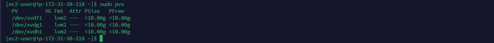

**IMPLIMENTING WORDPRESS WEBSITE WITH LVM STORAGE MANAGEMENT**

1. I unched EC2 redheart linux instance called **Web-serverRH**

     

 2.  I created 3 volumes with 10gb of storage each on the same availability zone with my Redhat Webserver.

      

 3. I attached the 3 volumes one by one to my redhat instance

   
   
     
4. .     With termiux ssh client, I connected successfully to my redhat instance and updated it using the comand **sudo yum update** 

     

5. I used lSBlK commad to inspect the blocks that are attached to my server 

   

6.  I used df -h to see all the mouts and free space

    

7.  I used **gdisk** utility to create a single partition on the 3 volumes i created with name sudo xvdf xvdg xvdh

     

8.  I now used lsbkl command to view my newly configured partitions.

     

9.  I installed Lvm2 package using the command **sudo yum install lvm2 -y**

      
     

10.  I now use pvcreate the mark all the 3 disk as physical volumes to be used by lvm

     

11. I used command **sudo pvs** to see that the 3 physical volumes have been successfully created 

     

12. I now used VGcreate to add all the PVs to a volume group and giving the VG name as webdata-vg

     

13.  I used sudo vgs command to varify that VG was create successfully.

      

14.  

    

